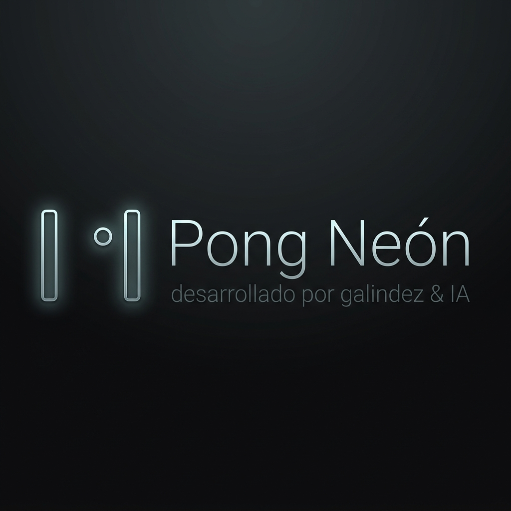

# 🏓 Pong Neón

Una hiper-estilizada versión Cyberpunk del clásico juego de arcade **Pong**, con música synthwave de fondo, partículas explosivas y físicas en tiempo real. Este proyecto forma parte de la **Franquicia Neón** y conserva estrictamente toda la arquitectura híbrida y filosofía de diseño visual de sus títulos hermanos (Ritmo Neón Serpiente y Tetris Neón).

🚀 **¡Juega la versión en vivo alojada en Google Cloud Run aquí!**  
▶️ **[https://juegopong-956223175156.europe-west1.run.app/]**

---

## 🕹️ Mecánicas de Juego

- Mueve tu paleta para rechazar la pelota usando físicas puras (Táctil o Teclado).
- Cada rebote incrementa sutilmente la velocidad de la bola brillante.
- La Inteligencia Artificial adaptativa de la CPU tratará de interceptar (¡aunque comete pequeños fallos permitiéndote ganar!).
- El primero en dominar y llegar al **Límite de Puntos** termina la partida.
- Incluye tabla persistente "Global Ranking" impulsada por **SheetDB**.

## 💻 Controles Híbridos Universales

Este motor está cuidadosamente construido para operar a 60 FPS fijos sin importar desde qué dispositivo juegues:

- **En PC:**
  - **Arriba / Abajo** (o **W / S**): Mueve la raqueta de tu jugador hacia arriba y hacia abajo suavemente.
- **En Móviles:**
  - Solo apoya el dedo cerca de tu lado y **desliza** (Swipe / Arrastrar) para que la paleta persiga fielmente tu dedo.
- **Protección Inteligente:** Los controles de arrastre y teclado direccional bloquean intencionalmente el scroll nativo gracias a los eventos `preventDefault` para una inmersión fluida sin molestias mecánicas.

## 🛠️ Tecnologías y Arquitectura

Desarrollado bajo estancias estrictas y un marco normativo único:

- **React 19 + TypeScript + Vite**: Single Page Application estructurada, rápida y escalable.
- **Render `<canvas>` de Alto Rendimiento**: El motor gráfico opera con su propio Game Tick coordinado mediante `requestAnimationFrame`, divorciándose totalmente de manipulaciones de CSS-DOM del React Tree para mover a la pelota o enemigos.
- **Tailwind v4 CSS + Motion (Framer)**: El esqueleto Glassmorphism y utilidades visuales estéticas estilo retro o luces se hacen bajo Tailwind puro en un ambiente React.
- **Persistencia en la Nube Serverless**: Un script especializado comunica e intercepta cada victoria a una tabla `SheetDB` global asíncrona.
- **Alarma BeforeUnload:** Prevención segura de cierres de ventanas inoportunos a media partida para evitar enojo del usuario.
- **Docker + CI/CD GCRN Nginx**: Construcción Multi-stage alpine contenida operando el puerto interno 8080.
